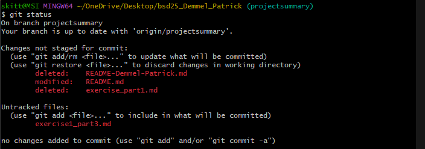
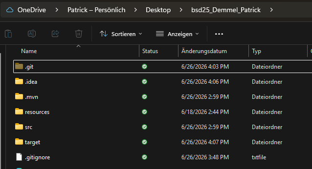
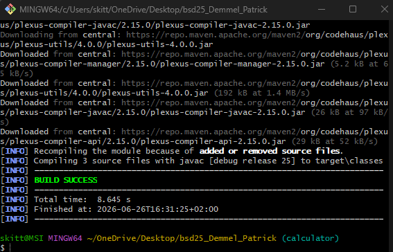
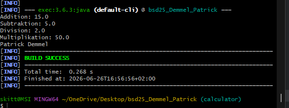
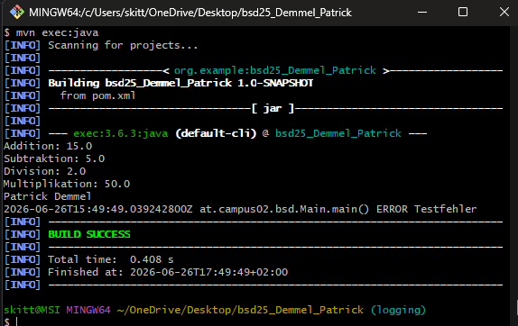

# Maze

## Beschreibung
In diesem Projekt geht es darum ein Labyrinth zu generieren und mit einem Suchalgorythmus zu lösen.

## Installationsanleitung
Das Framework muss in eine IDE eingebunden werden.

## Anleitung zur Verwendung des Beispiels
Um die Größe des Labyrinths anzugeben müssen diese Parameter an die IDE übergeben werden.

## Möglichkeiten der Mitarbeit
Von meiner Seite aus ist das Projekt fertig. Falls Verbesserungen gefunden werden oder Erweiterungen gewünscht sind, bitte diese an meine E-Mail schicken.

## Informationen zum Autor
Mein Name ist Patrick und ich habe dieses Programm für ein Uni-Projekt geschrieben.
patrick.maze@gmail.com

# Alle Übungen

- Exercise1 [Part1](exercise1_part1.md)
- Exercise1 [Part2](exercise1_part2.md)
- Exercise1 [Part3](exercise1_part3.md) )
- Exercise2 [Part1](exercise2.md) , , , 

## Logging-Konfiguration
Die Datei log4j2.xml.template dient als Vorlage. Vor dem Start muss diese Datei zu log4j2.xml kopiert und bei Bedarf angepasst werden.

## Echte Informationen zum Autor
Link zur GitHub [Profilseite](https://github.com/Patrick5435/patrick5435.github.io.git)
Link zu ihrer [Hochschule](https://www.campus02.at)
Version 1.2